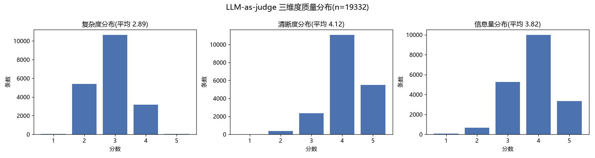
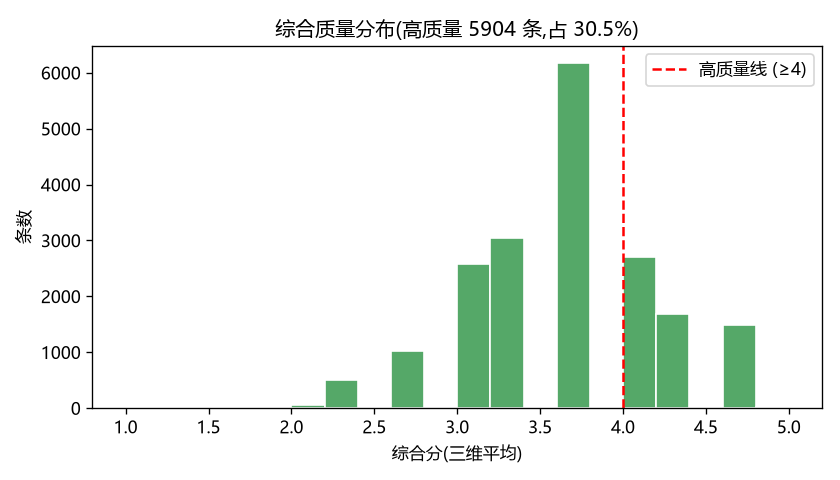
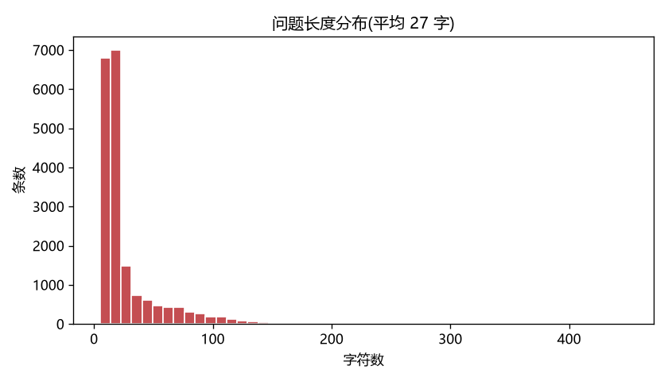
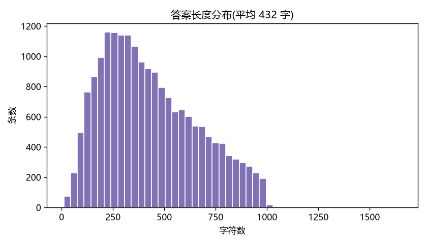

# legal-sft-dataset

构建一个**中文法律领域的 SFT(监督微调)数据集**:从公开来源采集"法律问答"对,经过清洗、去重、质量过滤,最终格式化成可直接用于大模型微调的训练数据。

📦 **数据集已开源到 HuggingFace**:[noah248/chinese-legal-sft](https://huggingface.co/datasets/noah248/chinese-legal-sft)

## 数据成果

| | |
|---|---|
| 📦 最终有效数据 | **19,332** 条法律问答对(Alpaca 格式) |
| 🗂️ 数据来源 | 开源数据集 DISC-Law-SFT 冷启动 + 自建爬虫工程(已跑通) |
| ✅ 总有效率 | 96.7%(20,000 → 19,332) |
| 🧹 去重 | 精确去重 0.5% + MinHash 近似去重 2.6% |
| 📐 平均长度 | 问题 27 字 / 答案 432 字 |
| 🛠️ 技术栈 | Python · pandas · asyncio · requests · MinHash(datasketch)· SQLite |

> 完整逐级统计见 [`docs/quality_report.md`](docs/quality_report.md);训练数据见 `data/processed/legal_sft.jsonl`。

## 数据质量分析(LLM-as-judge)

用 DeepSeek 对全部 19,332 条数据从**复杂度、清晰度、信息量**三个维度打分(1-5 分),识别出综合分 ≥4 的**高质量子集 5,904 条(30.5%)**用于训练。





**主要发现**:复杂度集中在 2-3 分,说明数据多为常见法律咨询、疑难案例偏少 —— 据此可针对性合成高复杂度样本补充。

| 问题长度分布 | 答案长度分布 |
|---|---|
|  |  |

## 为什么做这个

大模型在通用语料上预训练后,要靠 SFT 才能学会"按指令、按领域回答"。中文法律是一个**高价值、高门槛**的垂直领域:问答结构天然成对(咨询→解答),但公开的高质量数据稀缺。本项目就是把散落的法律问答整理成一份干净、可训练的数据集。

## 技术路线

```
采集 (collect) → 清洗 (clean) → 去重 (dedup) → 质量过滤 (filter) → 格式化 (format)
```

- **采集**:① HuggingFace 现成中文法律数据集冷启动;② 自建爬虫补充(百度知道等问答源)
- **清洗**:去 HTML 残留、空白、广告噪声,统一编码
- **去重**:精确去重 + 近似去重(MinHash / SimHash)
- **质量过滤**:剔除过短、答非所问、无专业含量的样本
- **格式化**:转成 SFT 训练格式(如 `{"instruction":..., "input":..., "output":...}`)

## 目录结构

```
legal-sft-dataset/
├── data/
│   ├── raw/          # 原始采集数据(不进 git,见 .gitignore)
│   └── processed/    # 清洗后/格式化后的数据
├── docs/
│   └── data_sources.md   # 数据源调研记录
├── exercises/        # 学习练习脚本(Day 1 的 pandas 练习等)
├── scripts/          # 可独立运行的工具脚本(下载、爬取、处理)
├── src/              # 项目核心代码(爬虫、清洗管线等)
├── requirements.txt
└── README.md
```

## 快速开始

```bash
# 1. 安装依赖
pip install -r requirements.txt

# 2. 冷启动:从 HuggingFace 下载第一批中文法律数据(走国内镜像)
python scripts/download_seed_data.py

# 3. 用 pandas 看一眼数据质量
python exercises/inspect_csv.py data/raw/seed_*.csv

# 4. 跑数据处理流水线:清洗→去重→质量过滤→格式化,并生成质量报告
python src/build_dataset.py
```

## 本周(第 1 周)计划

采集为主,目标:用现成数据集冷启动 + 自建爬虫走量,拿到第一批 1-2 万条真实法律问答。
详见 Obsidian 笔记《第1周学习计划-详细教学版》。

## 进度

- [x] Day 1 — 项目脚手架 + pandas/工程基础
- [x] Day 2 — HuggingFace 现成数据集冷启动(项目"有数据")
- [x] Day 3 — 异步限流 demo + 静态页爬取(代码就绪,跑通)
- [~] Day 4 — 数据源调研(文档骨架已建,结论待填)
- [x] Day 5 — 同步爬虫:sqlite 断点续爬 + 重试 + 死信(代码就绪,跑通)
- [x] Day 6 — tqdm 进度监控 + 每批汇总(代码就绪)
- [~] Day 7 — 周报模板已建(待填实际数据)

> 说明:Day 3/5/6 的**代码骨架已写好并在演示站点(quotes/books.toscrape.com)跑通**。
> 真正要你自己做的是:读懂这些代码、把 `src/crawler/parsers.py` 里的 `BaiduZhidaoParser`
> 填成真实法律问答源,以及完成调研/周报里的判断部分。

## 代码地图(给读码用)

| 文件 | 对应 | 直接运行 |
|---|---|---|
| `exercises/inspect_csv.py` | Day 1 CSV 质检 | `python exercises/inspect_csv.py data/raw/*.csv` |
| `scripts/download_seed_data.py` | Day 2 冷启动下载 | `python scripts/download_seed_data.py --limit 5000` |
| `src/async_demo.py` | Day 3 异步 + Semaphore 限流 | `python src/async_demo.py` |
| `src/static_scrape_demo.py` | Day 3 requests+bs4 静态爬 | `python src/static_scrape_demo.py` |
| `src/crawler/storage.py` | Day 5 sqlite 去重/断点/死信 | (被主程序调用) |
| `src/crawler/fetcher.py` | Day 5 重试/超时/限速 | (被主程序调用) |
| `src/crawler/parsers.py` | 解析适配层(换站点改这里) | (被主程序调用) |
| `src/crawler/run_crawler.py` | Day 5+6 主爬虫 + 进度 | `python -m src.crawler.run_crawler --site quotes` |
| `src/build_dataset.py` | 清洗→去重→质量过滤→格式化 + 质量报告 | `python src/build_dataset.py` |
